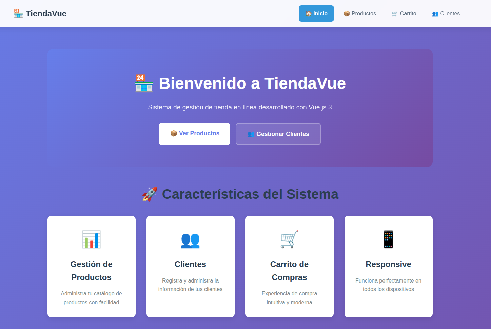

# Tienda-Web-con-Vue.js - Documentación Completa

Este proyecto es una tienda web desarrollada 100% con Vue 3 y Vite. Está diseñado como una práctica y tutorial para aprender Vue.js desde cero, con ejemplos claros y funcionales.

---

## Contenido

- [Requisitos](#requisitos)
- [Instalación y ejecución](#instalación-y-ejecución)
- [Estructura del proyecto](#estructura-del-proyecto)
- [Componentes principales](#componentes-principales)
- [Gestión del estado](#gestión-del-estado)
- [Navegación y rutas](#navegación-y-rutas)
- [Pruebas y desarrollo](#pruebas-y-desarrollo)
- [Recursos adicionales](#recursos-adicionales)

---

## Requisitos

- Node.js (versión 20 o superior recomendada)
- npm (gestor de paquetes de Node.js)
- Editor de código recomendado: [VSCode](https://code.visualstudio.com/) con la extensión [Volar](https://marketplace.visualstudio.com/items?itemName=Vue.volar)

---

## Instalación y ejecución

1. Clona o descarga este repositorio.
2. Abre una terminal en la carpeta del proyecto.
3. Ejecuta para instalar dependencias:

```sh
npm install
```

4. Para iniciar el servidor de desarrollo con recarga en caliente:

```sh
npm run dev
```

5. Abre tu navegador en la URL que muestra la terminal (por defecto http://localhost:5173).

6. Para construir la versión de producción:

```sh
npm run build
```

7. Para previsualizar la versión de producción:

```sh
npm run preview
```
---

## Vista previa de la aplicación

A continuación, una imagen de la página de inicio de TiendaVue para que tengas una idea visual del proyecto:



---

## Estructura del proyecto

- `src/`: Código fuente de la aplicación
  - `components/`: Componentes Vue reutilizables
  - `views/`: Vistas principales para las rutas
  - `store/`: Gestión del estado global (carrito de compras)
  - `router/`: Configuración de rutas con Vue Router
- `public/`: Archivos estáticos públicos
- `index.html`: Archivo HTML principal
- `vite.config.js`: Configuración de Vite

---

## Componentes principales

- **ListaProductos.vue**: Muestra el catálogo de productos con búsqueda y botones para agregar al carrito o ver detalles.
- **ProductoDetalleView.vue**: Vista detallada de un producto con imágenes, descripción, especificaciones y opción para agregar al carrito.
- **RegistroClientesValidacion.vue**: Formulario de registro de clientes con validaciones (ejemplo adicional).
- **Carrito**: Estado global gestionado con un store reactivo en `src/store/cart.js`.

---

## Gestión del estado

El carrito de compras se maneja con un store global reactivo usando la API Composition de Vue (`reactive`, `readonly`). Esto permite compartir el estado del carrito entre componentes sin necesidad de librerías externas.

Funciones principales del store:

- `agregarProducto(producto)`: Añade un producto al carrito o incrementa la cantidad si ya existe.
- `eliminarProducto(productoId)`: Elimina un producto del carrito.
- `limpiarCarrito()`: Vacía el carrito.

---

## Navegación y rutas

Se utiliza Vue Router para manejar la navegación entre vistas:

- `/productos`: Lista de productos
- `/productos/:id`: Detalle de un producto específico
- `/clientes`: Registro y gestión de clientes
- `/carrito`: Vista del carrito (puede ser implementada)

La navegación programática se realiza con `router.push()`.

---


## Recursos adicionales

- [Documentación oficial de Vue 3](https://vuejs.org/)
- [Guía de Vue Router](https://router.vuejs.org/)
- [Vite - Herramienta de construcción](https://vite.dev/)
- [Curso gratuito de Vue.js](https://www.vuemastery.com/)

---

## Vista previa de la aplicación

A continuación, una imagen de la página de inicio de TiendaVue para que tengas una idea visual del proyecto:


