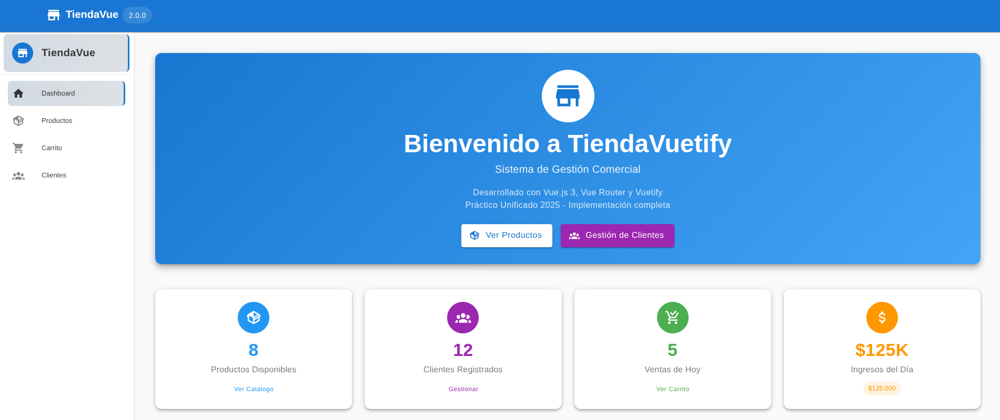

# TiendaVue - Plataforma de Gestión Comercial

  

## Descripción

TiendaVue es una aplicación web moderna y responsive desarrollada con Vue.js 3 y Vuetify 3, diseñada para la gestión de una tienda en línea. Esta plataforma permite a los usuarios visualizar productos, agregar items a un carrito de compras, gestionar clientes y acceder a un dashboard principal.

El proyecto fue creado como parte de las prácticas de frontend para Ingeniería Web III 2025 (IW 2025), enfocándose en el uso de componentes Material Design, manejo de estado con refs y computed properties, y navegación SPA con Vue Router.

## Características Principales

- **Dashboard Inicial**: Pantalla de bienvenida con estadísticas clave (productos, clientes, ventas) y accesos rápidos a secciones principales.
- **Gestión de Productos**: Lista de productos con detalles como nombre, precio y stock. Incluye vista detallada por producto y funcionalidad para agregar al carrito.
- **Carrito de Compras**: Gestión completa del carrito con incremento/decremento de cantidades, eliminación de items, cálculo de subtotales y total general. Soporte para notificaciones en tiempo real.
- **Gestión de Clientes**: Sección dedicada para visualizar y potencialmente registrar clientes (implementación básica).
- **Navegación Responsive**: Menú lateral (drawer) adaptable a dispositivos móviles.
- **Sistema de Notificaciones**: Snackbar de Vuetify para feedback al usuario (éxitos, errores, info).
- **Base de Datos Simulada**: Productos hardcodeados en el componente principal para demostración, con verificación de stock al agregar al carrito.

## Tecnologías Utilizadas

- **Frontend**: Vue.js 3 (Composition API)
- **UI Framework**: Vuetify 3 (basado en Material Design 3)
- **Enrutamiento**: Vue Router 4
- **Herramientas de Construcción**: Vite (para desarrollo rápido y HMR)
- **Iconos**: Material Design Icons (@mdi/font)
- **Estilos**: Sass para personalización de Vuetify
- **Otras Dependencias**: Pinia (preparado para state management futuro), unplugin-vue-components para importación automática.

## Instalación

1. **Clona o Descarga el Proyecto**:
   Asegúrate de estar en el directorio del proyecto:
   ```
   cd /ruta/al/proyecto/tienda_vuetify
   ```

2. **Instala las Dependencias**:
   Usa tu gestor de paquetes preferido:
   - **npm**:
     ```
     npm install
     ```

3. **Configuración Opcional**:
   - Para suprimir warnings de JSON en Node.js (si es necesario), agrega `NODE_OPTIONS='--no-warnings'` a tus scripts de desarrollo en `package.json`.
   - Asegúrate de tener Node.js >= 18 y npm/yarn instalados.

## Uso

### Desarrollo Local

Ejecuta el servidor de desarrollo con hot-reload:
```
npm run dev
```

La aplicación estará disponible en [http://localhost:3000](http://localhost:3000). Abre esta URL en tu navegador para ver el prototipo en acción.

### Construcción para Producción

Para generar una versión optimizada lista para deploy:
```
npm run build
```

### Navegación

- **/**: Dashboard de inicio.
- **/productos**: Lista de productos.
- **/productos/:id**: Detalle de un producto específico.
- **/carrito**: Vista del carrito de compras.
- **/clientes**: Gestión de clientes.

### Funcionalidades Clave en Acción

1. Navega a `/productos` y haz clic en "Agregar al Carrito" en un producto con stock.
2. Ve a `/carrito` para modificar cantidades o eliminar items.
3. En móvil (simulado), el drawer se colapsa y se accede vía deslizamiento.

## Estructura del Proyecto

```
tienda_vuetify/
├── public/                 # Archivos estáticos (favicon, etc.)
├── src/
│   ├── assets/             # Imágenes, CSS personalizados
│   │   └── css/custom-vuetify.css
│   ├── components/         # Componentes reutilizables (CarritoMinimo, ProductosLista, etc.)
│   ├── plugins/            # Configuraciones (vuetify.js)
│   ├── views/              # Vistas principales (InicioView, ProductosView, etc.)
│   ├── App.vue             # Componente raíz con layout y estado global
│   ├── main.js             # Punto de entrada y montaje
│   └── router.js           # Definición de rutas
├── index.html              # Plantilla HTML principal
├── package.json            # Dependencias y scripts
├── vite.config.mjs         # Configuración de Vite
└── README.md               # Este archivo
```